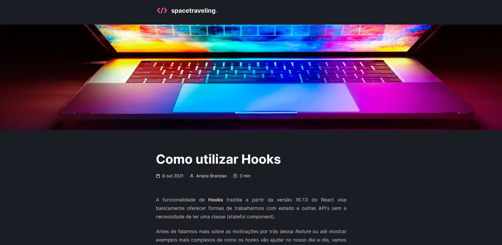

  

## spacetraveling

Um blog criado do zero. Esse é um desafio feito durante minha jornada no [Ignite](https://www.rocketseat.com.br/ignite), da Rocketseat.

## App online
Link: [desafio-prj-do-zero.vercel.app](https://desafio-prj-do-zero.vercel.app)

## Tecnologias

Esse projeto foi desenvolvido com as seguintes tecnologias:

- [NextJS](https://nextjs.org)
- [TypeScript](https://www.typescriptlang.org/)
- [Prismic](https://prismic.io)

## To-do (desafios 02)
- [x] Responsividade;
- [ ] Comentários com Utteranc;
- [ ] Preview do documento Prismic;
- [ ] Navegação entre post anterior e próximo;
- [ ] Informação de edição do post.;

## Layout

Você pode visualizar o layout do projeto através [desse link](https://www.figma.com/file/Le6SPyOsZfytC8N3yVzfFJ/Desafios-Módulo-3-ReactJS-(Copy)?node-id=0%3A1). É necessário ter conta no [Figma](http://figma.com/) para acessá-lo.

# Desafio: criando um projeto do zero

Essa será uma aplicação onde o seu principal objetivo é criar um blog do zero. Você vai receber uma aplicação praticamente em branco que deve consumir os dados do Prismic e ter a interface implementada conforme o layout do Figma. Você terá acesso a diversos arquivos para implementar:

- Estilizações global, comum e individuais;
- Importação de fontes Google;
- Paginação de posts;
- Cálculo de tempo estimado de leitura do post;
- Geração de páginas estáticas com os métodos `getStaticProps` e `getStaticPaths`;
- Formatação de datas com `date-fns`;
- Uso de ícones com `react-icons`;
- Requisições HTTP com `fetch`;
- Entre outros.

## O que devo editar na aplicação?

Com o template já clonado, as dependências instaladas e o Prismic já configurado, você deve completar onde não possui código com o código para atingir os objetivos de cada teste. Os documentos que devem ser editados são:

- src/pages/_document.tsx;
- src/pages/index.tsx;
- src/pages/home.module.scss;
- src/pages/post/[slug].tsx;
- src/pages/posts/post.module.scss;
- src/components/Header/index.tsx;
- src/components/Header/header.module.scss;
- src/styles/global.scss;
- src/styles/common.module.scss.

## Especificação dos testes

Em cada teste, tem uma breve descrição no que sua aplicação deve cumprir para que o teste passe.

Para esse desafio, temos os seguintes testes:

[Teste components/Header/index.tsx](https://www.notion.so/Teste-components-Header-index-tsx-e660ffcf817f43b1863e88e46361a12c)

[Testes pages/Home/index.tsx](https://www.notion.so/Testes-pages-Home-index-tsx-92311ae2694e48eaa8d9addda3afaed9)

[Testes pages/post/[slug].tsx](https://www.notion.so/Testes-pages-post-slug-tsx-4fd06de1728c4abda14d092da382c1df)

## Como executar

- Clone o repositório
- Instale as dependências com `yarn`
- Inicie o servidor com `yarn dev`

## Licença

Esse projeto está sob a licença MIT. Veja o arquivo [LICENSE](LICENSE.md) para mais detalhes.
